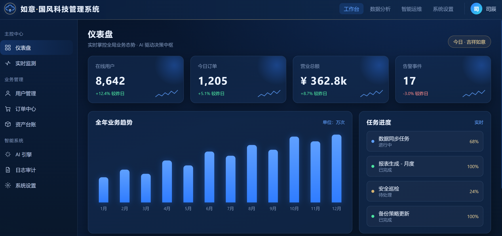
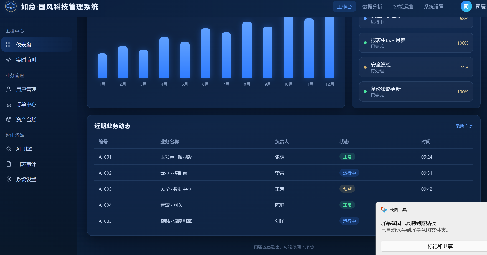

# 如意 · 国风科技管理系统

全栈 AI 驱动的现代管理系统。**前端 React + Vite**，后端规划为 **Gin（前后端分离）**。当前阶段已完成前端骨架与后台管理首页，接口采用 **mock** 实现，后续平滑替换为真实 Gin 接口。

> 主题：**如意国风科技蓝**（深海军蓝底 + 科技蓝/青色高亮 + 国风金线点缀，如意云纹徽标）。

---

## 技术栈

| 层 | 选型 |
| --- | --- |
| 前端框架 | React 18 + Vite 5 |
| 样式 | CSS 变量（主题 token）+ 组件级 CSS |
| 接口 | 当前 mock，预留 `services` 适配层对接 Gin |
| 后端（规划） | Gin + MySQL/PostgreSQL，RBAC 权限、动态菜单、代码生成 |

---

## 布局规范（默认采用）

- 整体 **满屏** 布局：宽高 = 屏幕宽高（`100vw` / `100vh`），不出现整体页滚动。
- **顶部栏**：固定高度 `60px`，横向铺满。
- **左侧栏**：固定宽度 `224px`，纵向铺满主体高度，内部可滚动。
- **内容区**：自适应剩余空间，高度超出时 **仅内容区内部滚动**，不影响顶栏与侧栏。

> 若后续需求与上述布局不一致，先向用户确认，不要直接改动默认布局。

---

## 项目截图

> 将两张项目截图放入 `docs/screenshots/` 目录后，替换下方图片路径即可。





## 目录结构（业务与通用层解耦）

```
.
├─ AGENTS.md                 # 项目约定与布局偏好
├─ README.md
├─ frontend/
│  ├─ index.html
│  ├─ package.json
│  ├─ vite.config.js
│  └─ src/
│     ├─ main.jsx            # 入口（加载全局样式 + 主题 token）
│     ├─ App.jsx             # 根组件：装配 AdminLayout + 页面注册表
│     ├─ lib/                # ★ 可复制通用层（与业务零耦合）
│     │  ├─ theme/tokens.css # 主题 token（默认：如意国风科技蓝）
│     │  ├─ components/      # 组件库：ui/(Card/Badge/StatCard/BarChart/DataTable/Button/Sparkline) + RuyiEmblem + icons + index.js
│     │  ├─ layout/          # AdminLayout 外壳 + TopBar + SideBar
│     │  ├─ hooks/           # useRequest 通用请求 hook
│     │  └─ utils/           # format 等工具
│     ├─ modules/            # ★ 业务模块（二次开发只动这里）
│     │  └─ dashboard/
│     ├─ services/           # 接口适配层（request + dashboard，mock→真实开关）
│     ├─ config/             # ★ 配置驱动：brand / menu / topnav / theme / pages
│     ├─ mock/data.js        # mock 数据源
│     └─ styles/global.css   # 全局 reset
```

设计目标：**复制仓库骨架 → 只改配置与业务模块 → 即可二次开发新系统**。

---

## 快速开始

```bash
# 进入前端目录
cd frontend

# 安装依赖
npm install

# 启动开发服务器（默认 http://localhost:5173）
npm run dev

# 生产构建
npm run build

# 本地预览构建产物
npm run preview
```

---

## 二次开发指南

本系统采用 **配置驱动 + 分层解耦**，新增一个业务模块只需三步：

### 1. 新增菜单（`src/config/menu.js`）
在对应分组追加一项，指定 `key` / `label` / `icon`（图标在 `src/lib/components/icons/Icons.jsx` 注册）：
```js
{ key: 'users', label: '用户管理', icon: 'user' }
```

### 2. 编写业务模块（`src/modules/<模块名>/`）
新建页面组件，复用 `lib` 组件与 `services` 接口，例如：
```jsx
import { useRequest } from '../../lib/hooks/useRequest'
import { Card, DataTable } from '../../lib/components'
import { getUsers } from '../../services/users'

export default function UsersPage() {
  const { data } = useRequest(getUsers)
  return <Card title="用户列表"><DataTable columns={...} data={data} /></Card>
}
```

### 3. 注册页面（`src/config/pages.js`）
```js
import UsersPage from '../modules/users/UsersPage'
export const pages = { dashboard: DashboardPage, users: UsersPage }
```

> 通用层（`lib/`、`config/` 结构、`layout/`）**无需改动**。

---

## 接口切换（mock → 真实 Gin）

统一在 `src/services/request.js` 控制：
```js
export const USE_MOCK = true   // 置 false 并完善 fetch 逻辑即对接真实后端
```
业务接口写在 `src/services/*.js`，例如：
```js
export function getOverview() {
  // 当前：return mockApi.getOverview()
  // 对接后端：return request('/api/overview')
}
```

---

## 主题定制

主题色集中于 `src/lib/theme/tokens.css` 的 CSS 变量（`:root`）。换肤时：
- 复制一套 token 变量（如 `.theme-dark`、`[data-theme="xxx"]`），
- 在 `src/config/theme.js` 登记并切换到对应主题即可，组件无需改动。

默认主题：**如意国风科技蓝**。

---

## 后续规划

- [ ] `backend/`：Gin 通用脚手架（RBAC、动态菜单、字典、操作日志、代码生成器）。
- [ ] 模板仓库化：将 `lib/ + config/ + layout/` 抽为可独立复制的骨架，新项目 clone 后改名即用。
- [ ] 补充更多业务模块示例与组件库文档/示例页。
- [ ] 后端按角色下发菜单/路由，前端仅渲染。
